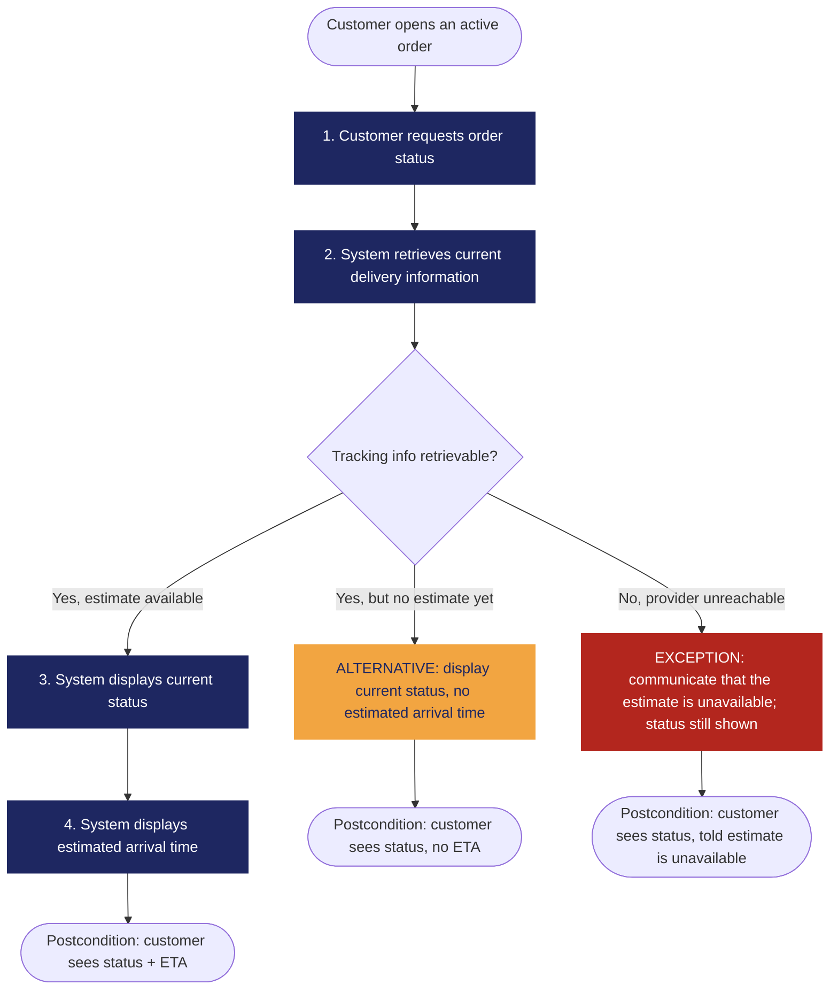

<!--
WORKED EXAMPLE — not a blank to fill in.
This shows how Requirement_Template.md looks once completed, using the
Food Delivery System running example from Classes 8, 9, and 10.
Use it as a reference for tone, level of detail, and how the sections
connect to each other — not as content to copy into your own requirement.
-->

# REQ-07 — Display Estimated Arrival Time

| | |
|---|---|
| **Status** | Validated |
| **Team / Author(s)** | Example Team — Food Delivery System |
| **Date** | 2026-09-30 |
| **Linked User Story / AC** | US-07, AC-07.1, AC-07.2 |

---

## 1. Overview

**Requirement Statement**
> The system shall display the estimated arrival time for an active order.

**Type:** Functional
*(Perfect Technology Filter: even with infinite speed, unlimited memory, zero failures, and zero cost, the customer would still need to be told when the order arrives — the behavior itself doesn't disappear. Functional.)*

**Source / Evidence**
> Discovery Sheet, Evidence E-03 — stakeholder interview: "Users want to see the driver's location in real time so they know when their order will arrive."

**Need**
> Know when my order will arrive. *(Note: the stakeholder's literal request — a real-time GPS map — was a proposed solution, not the need itself. The need is knowing the arrival time; a map is only one way to satisfy it.)*

**Value / Rationale**
> Reduce customer uncertainty while waiting for an order.

---

## 2. Context — A Requirement Rarely Stands Alone

**Business Rule(s)**
> BR-04 — Estimated arrival information must not be displayed until the order has been accepted by the restaurant. (Domain rule: an unaccepted order has no meaningful preparation timeline yet, so any ETA shown earlier would be fabricated, not estimated.)

**Constraint(s)**
> The solution must integrate with the existing third-party delivery tracking provider — we are not building our own GPS/location infrastructure for this requirement.

**Assumption(s)**
> Driver tracking data will be sufficiently available, in near-real time, to calculate a usable ETA. *(Not yet fully verified against the tracking provider's actual uptime.)*

**Dependenc(ies)**
> Reliable delivery tracking information from the third-party provider's API.

**Risk(s)**

| Risk | Likelihood | Impact | Mitigation (optional) |
|---|---|---|---|
| Tracking information from the provider is delayed or temporarily unavailable | Medium | Medium–High (ETA becomes inaccurate or cannot be shown) | Fall back to showing order status without an ETA rather than a stale or wrong one (see Exception flow, Section 4.3) |

**Open Questions**
> What should the customer see during the specific window where the provider reports *a* status but not yet usable coordinates (neither clearly "available" nor clearly "unavailable")? Not yet resolved with the stakeholder — treated as an edge case to revisit, not guessed at here.

---

## 3. Priority & Estimation

*(This example applies two models side by side to show what each one reveals — your own template only asks you to pick ONE model per requirement. Use both here only if you want to double-check a borderline call.)*

**Model 1 — MoSCoW**

**Priority assigned:**
> Because customers consistently named delivery-time visibility as their top source of anxiety while waiting for an order (Evidence E-03 and related interview notes), we assigned **Must have**, accepting the trade-off of de-prioritizing some secondary order-history features this iteration. We considered **Should have** and rejected it because removing this capability would make the core "track my order" experience unacceptable to users.

**Model 2 — RICE**

| Factor | Value | Reasoning |
|---|---|---|
| **Reach** | ~2,500 orders/week | Nearly every active order passes through this screen at least once |
| **Impact** | 3 (massive) | Directly addresses the #1 pain point surfaced in evidence (E-03) |
| **Confidence** | 80% | Reach and impact both come from direct stakeholder evidence, not guesswork |
| **Effort** | 2 person-weeks | Display logic is simple; most effort is the tracking-provider integration already scoped in Section 2 |

> **RICE score** = (2,500 × 3 × 0.8) / 2 ≈ **3,000**
> *(Only meaningful compared to other requirements' RICE scores in the same backlog — not as a standalone number.)*

**Comparing the two:**
> Both models agree this requirement sits near the top — MoSCoW puts it in Must have, and RICE gives it a high score mainly driven by Reach and Confidence rather than Effort (which is modest). The value of running both here wasn't to get a "better" answer — MoSCoW alone already gave a defensible, well-argued priority — but RICE forced us to make Effort and Confidence explicit, which is useful when this requirement later gets compared against others with a very different effort profile. For the rest of this project's backlog, the team is standardizing on **MoSCoW** as the single model (consistency across requirements matters more than running two models every time); RICE was used here only as a cross-check on this particular high-stakes requirement.

**Estimate (confidence):** Medium
> We understand the core display logic well (it's a straightforward read-and-render). What we're less sure about is integration behavior with the tracking provider under failure or partial-data conditions — that's the part driving the confidence down from High.

---

## 4. Representations — Requirement ≠ Representation

### 4.1 User Story

> As a **customer**,
> I want to **see the estimated arrival time for my active order**,
> so that **I know when to expect my order**.

*Check: the "I want" names an outcome (seeing an estimate), not a specific solution like a map — it passes the need-vs-solution check from Class 8.*

### 4.2 Acceptance Criteria

**Scenario 1 — ETA available**
> **Given** an active order with an available estimate
> **When** the customer opens the order status
> **Then** the estimated delivery time is displayed

**Scenario 2 — ETA unavailable (exception)**
> **Given** an active order without an available estimate
> **When** the customer opens the order status
> **Then** the current status is displayed without an estimated arrival time

### 4.3 Use Case

| Field | |
|---|---|
| **Use Case name** | Track Order |
| **Actor** | Customer |
| **Goal** | Know the current status and expected arrival of an active order |
| **Trigger** | Customer opens an active order |
| **Precondition** | The order exists and is active (accepted, not yet delivered or cancelled) |

**Main Flow**
1. Customer requests the order status.
2. System retrieves current delivery information from the tracking provider.
3. System displays the current status.
4. System displays the estimated arrival time.

**Alternative Flow**
> Estimate unavailable → System displays the current status without an estimated arrival time (Scenario 2).

**Exception**
> Tracking information cannot be retrieved from the provider → System communicates that the estimate is unavailable; the order status itself is still shown.

**Postcondition**
> The customer has visibility into the current status of their order, with an estimate whenever one is genuinely available.

**Flow Diagram**

*(Navy = main flow, amber = alternative, red = exception — same convention as the rest of this course's materials.)*

---

## 5. Traceability & Impact

**Backward — why does this requirement exist?**
> Evidence E-03 → Need N-02 ("know when my order will arrive") → REQ-07.

**Forward — what will this affect?**
> REQ-07 → future Design (an order-status display component, plus an integration layer for the tracking provider) → Implementation → Tests (AC-07.1 and AC-07.2 as the verification basis). *(Design has not happened yet — this section will be filled in further once Class 11 work begins.)*

**Impact Analysis — if this requirement changes, what else might need to change?**
- [ ] Business Rules
- [x] Constraints
- [x] Dependencies
- [x] Risks
- [x] Acceptance Criteria
- [x] Estimate
- [ ] Priority
- [x] Future Design
- [x] Future Tests

> If the tracking provider changes (e.g., we switch vendors), Constraints, Dependencies, Risks, and both future Design and Tests would all need review. Business Rule BR-04 and Priority are unlikely to move — they depend on customer behavior and business policy, not on which provider we integrate with.

---

## 6. Validation — Quality Gate

- [x] **Valid?** Yes — traces directly to Evidence E-03 and Need N-02, not invented.
- [x] **Clear / Unambiguous?** Yes — "estimated arrival time for an active order" has one reasonable reading.
- [x] **Atomic?** Yes — one independently testable expectation (display the ETA), not bundled with unrelated behavior.
- [x] **Necessary?** Yes — removing it breaks the core value proposition identified in the evidence.
- [x] **Feasible?** Yes, given the existing tracking provider integration — no new infrastructure required.
- [x] **Verifiable?** Yes — AC-07.1 and AC-07.2 give concrete, observable pass/fail conditions.
- [x] **Consistent?** Yes — no conflict identified with other requirements in this set.
- [ ] **Complete enough?** Not fully — the Open Question about the partial-data edge case (Section 2) is still unresolved.
- [x] **Traceable?** Yes — every section above points back to real evidence or an explicitly marked assumption/open question, nothing invented to fill a blank.

> One box unchecked: the partial-data edge case is a genuine Open Question, not a guess. Status stays **Validated** rather than fully closed until that's resolved — consistent with "if something is missing, go back and discover again" rather than inventing an answer here.
