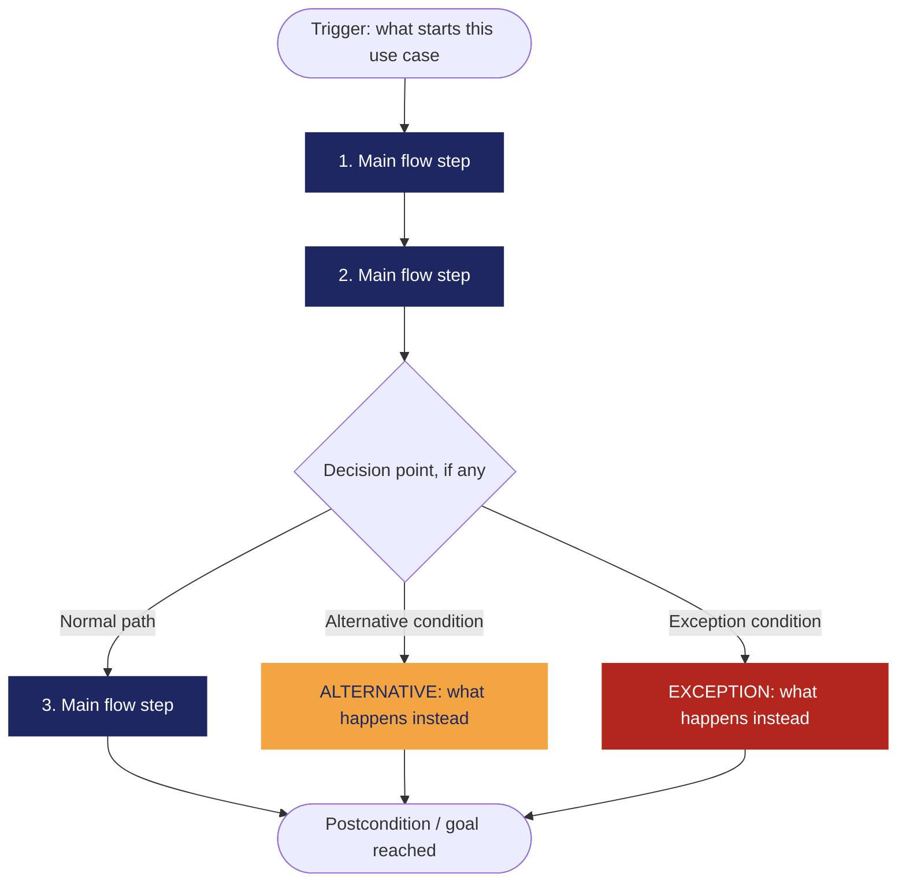

# [REQ-001] — [Generación de Horario según preferencias]

| | |
|---|---|
| **Status** | Draft / Validated / Open Question |
| **Team / Author(s)** | Jonathan Ramírez Contreras, Carlos Stiven Romero Sicacha, Julian Ricardo Rodríguez Villamizar |
| **Date** | October 08, 2026 |
| **Linked User Story / AC** | N/A (Viendo el ejemplo no entendemos como se llena esta celda del cuadro) |

---

## 1. Overview

**Requirement Statement**
> El sistema generará combinaciones de horarios académicos a partir de una lista de asignaturas seleccionada, garantizando que las opciones generadas no presenten cruces de horarios y cumplan con la carga mínima de créditos requerida para el semestre actual y con las [preferencias](../glosario.md) del estudiante.

**Type:** Functional
*(Si tuviéramos un computador perfecto con capacidad de procesamiento infinita, aún necesitaríamos que el sistema ejecutara esta lógica de implementación para combinar los horarios. Por tanto, es funcional).*

**Source / Evidence**
> Viene de la entrevista al stakeholder (Otro estudiante): "El estudiante quiere tener disponibles varias opciones de horarios para poder ajustarlos a sus preferencias y mirar cuáles materias le conviene más ver en el semestre, de manera rápida y sin hacerlo a mano".

**Need**
> Generar diferentes combinaciones de horarios académicos de manera automática a partir de una lista de asignaturas seleccionada.

**Value / Rationale**
> Reducir la incertidumbre para elegir materias y tener diferentes opciones de horarios que se ajusten según las [preferencias](../glosario.md) del estudiante.

---

## 2. Context — A Requirement Rarely Stands Alone

**Business Rule(s)**
> Dependencia Semestral de Carga Mínima: La cantidad mínima de créditos que un estudiante está obligado a inscribir no es un valor universal, sino que está estrictamente determinada por la Universidad cada semestre. Ningún horario es válido para formalizar matrícula si la suma total de sus créditos es inferior a este tope exigido.
> Un estudiante no puede estar inscrito simultáneamente en dos o más grupos académicos si existe cualquier coincidencia (solapamiento) de días y horas en sus franjas de clase.

**Constraint(s)**
> El sistema debe calcular combinaciones que no presenten cruces y que la cantidad de créditos no sea menor a la cantidad mínima. Dado que una materia puede tener múltiples grupos, el número de combinaciones crece exponencialmente.

**Assumption(s)**
> 1. Asumimos que el sistema ya cuenta con la información actualizada y centralizada de la oferta académica (materias, grupos, horarios, cupos).
> 2. Asumimos que la "carga mínima de créditos" es un valor dado a conocer por la Universidad.

**Dependenc(ies)**
> Buscador de cursos del Sistema de Información Académica (SIA)

**Risk(s)**
> What uncertain event or condition could negatively affect this requirement or its delivery? For each risk, note a rough Likelihood and Impact (High / Medium / Low) and, if you have one, a brief mitigation note.

| Risk | Likelihood | Impact | Mitigation (optional) |
|---|---|---|---|
| | | | |

**Open Questions**
> Anything still unresolved — ambiguity, a question no stakeholder has answered yet, a missing piece of evidence. List it here instead of guessing.

---

## 3. Priority & Estimation

**Priority model used:** MoSCoW / Kano / RICE / WSJF / Value-Effort *(pick the one that fits the decision you're actually making — see Class 10's comparison if you need to decide which)*

**Priority assigned:**
> Because [the situation/signal from your project], we assigned [priority value], accepting the trade-off of [what you're giving up by not prioritizing it higher/lower]. We considered [alternative priority] and didn't use it because [reason].

**Estimate (confidence):** High / Medium / Low
> How sure are we about the size and shape of this work? *(This is a confidence tag, not a technique-based number — named estimation techniques like story points are Ingeniería de Software II content, not this course.)*

---

## 4. Representations — Requirement ≠ Representation

*(Class 9. Each representation reveals different information. Fill in all three below — for this capstone requirement, all three are required.)*

### 4.1 User Story

> As a **[role]**,
> I want **[capability]**,
> so that **[value]**.

*Check yourself: is the "I want" describing the need, or already prescribing a solution?*

### 4.2 Acceptance Criteria

*(At least two scenarios: one normal path, one alternative or exception.)*

**Scenario 1 — [short name]**
> **Given** [context]
> **When** [event/stimulus]
> **Then** [observable outcome]

**Scenario 2 — [short name, alternative or exception]**
> **Given** [context]
> **When** [event/stimulus]
> **Then** [observable outcome]

### 4.3 Use Case

| Field | |
|---|---|
| **Use Case name** | |
| **Actor** | |
| **Goal** | |
| **Trigger** | |
| **Precondition** | |

**Main Flow**
1.
2.
3.
4.

**Alternative Flow**
> [Condition] → [what happens instead]

**Exception**
> [Condition] → [what happens instead]

**Postcondition**
>

**Flow Diagram**
*(Replace the labels below with your own steps. Keep Main Flow, Alternative, and Exception visually distinct — delete whichever branch doesn't apply to your use case. This renders automatically on GitHub.)*

---

## 5. Traceability & Impact

*(Class 10. Conceptual, not a formal matrix.)*

**Backward — why does this requirement exist?**
> Evidence → Need → Requirement. Point to the specific evidence/need entries that justify this requirement (from your Discovery Sheet).

**Forward — what will this affect?**
> Requirement → future Design → Implementation → Tests. *(It's fine if Design hasn't happened yet — note what you expect this to touch once it does, and update this section once Class 11 work begins.)*

**Impact Analysis — if this requirement changes, what else might need to change?**
- [ ] Business Rules
- [ ] Constraints
- [ ] Dependencies
- [ ] Risks
- [ ] Acceptance Criteria
- [ ] Estimate
- [ ] Priority
- [ ] Future Design
- [ ] Future Tests

> Briefly note which of the above are actually likely to be affected, and why.

---

## 6. Validation — Quality Gate

*(Class 9 + Class 10. Self-audit before you commit this file. Check honestly — a "no" here means the requirement isn't ready yet, not that you should force a checkmark.)*

- [ ] **Valid?** Does it reflect a real, evidenced need — not an invented one?
- [ ] **Clear / Unambiguous?** Is there only one reasonable interpretation?
- [ ] **Atomic?** Is this one independently testable expectation, not several bundled together?
- [ ] **Necessary?** Does removing it actually break something real?
- [ ] **Feasible?** Can this realistically be built with what the team has?
- [ ] **Verifiable?** Can you demonstrate, concretely, whether it's satisfied?
- [ ] **Consistent?** Does it conflict with any other requirement in your set?
- [ ] **Complete enough?** Are there important functions or constraints still missing?
- [ ] **Traceable?** Can every part of this document be traced back to real evidence — not invented to fill a section?

> If any box is unchecked, say what's missing and whether it becomes an Open Question or sends you back to Class 8 (re-elicit) or Class 9 (re-specify).
